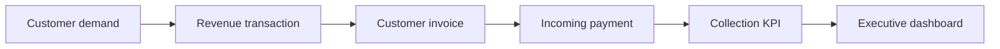
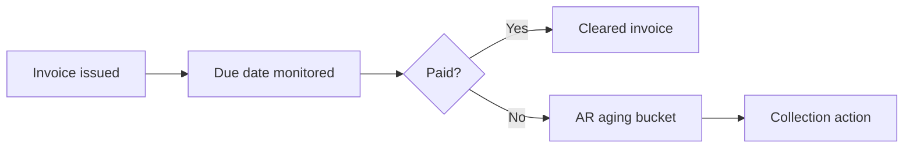
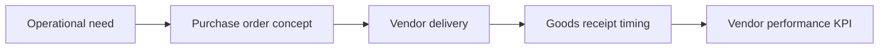
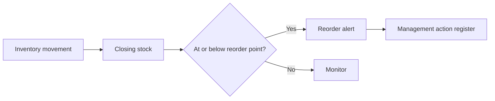
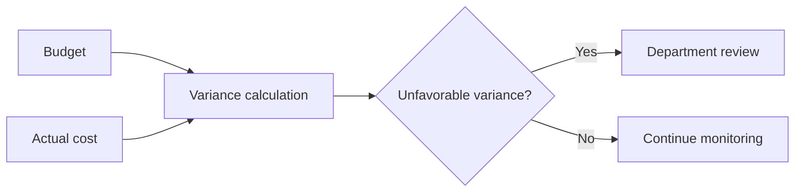
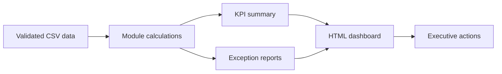

# ERP Process Flows

These Mermaid diagrams describe SAP S/4HANA-inspired process logic represented by the prototype. They are conceptual only and do not show a live SAP system.

## Order-to-cash / revenue-to-cash flow

Revenue is tracked separately from cash collection so management can see whether sales activity becomes cash.

## Invoice-to-cash flow

FI analysis highlights open receivables and overdue exposure.

## Procure-to-pay flow

MM reporting focuses on supplier reliability and spend visibility.

## Inventory replenishment flow

Reorder alerts identify items that can affect guest service levels.

## Cost center budget review flow

CO analysis supports department accountability and margin protection.

## Executive KPI reporting flow

The dashboard consolidates module-level outputs into management reporting.
