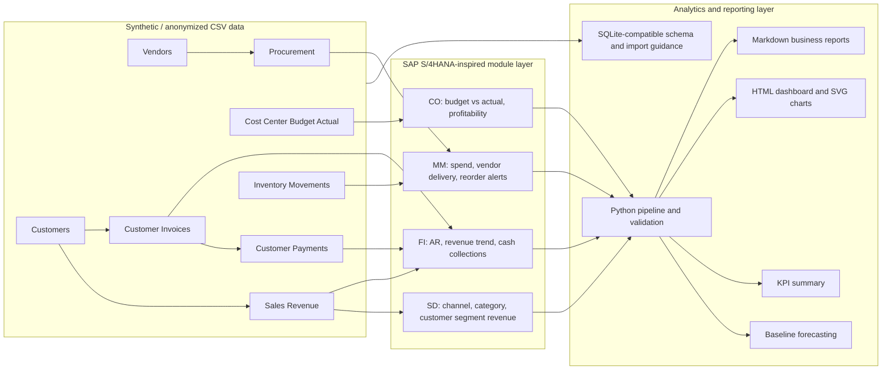

# SAP S/4HANA-Inspired ERP Analytics Architecture

The following Mermaid diagram provides a text-based architecture view that can be reviewed directly in GitHub.

## Architecture Notes

- The repository uses flat CSV files instead of a live ERP database so reviewers can inspect every input and output in GitHub.
- `scripts/validate_data.py` checks required files, columns, dates, non-negative values, foreign-key consistency, and blocked binary extensions before the analytics pipeline runs.
- `scripts/analytics_pipeline.py` regenerates Markdown reports, CSV summaries, SVG charts, forecasting outputs, and the HTML dashboard.
- The architecture is intentionally lightweight and portfolio-oriented; it demonstrates ERP analytics workflow design rather than SAP system administration or SAP implementation work.
