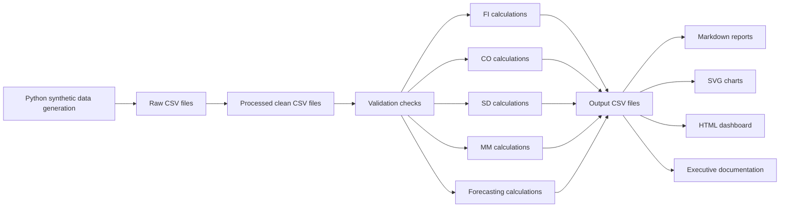

# Data Lineage

The project is intentionally text-based so reviewers can inspect every step in GitHub.

## Raw CSV generation
`scripts/generate_synthetic_data.py` creates deterministic synthetic/anonymized raw data files under `02_Data/raw/`.

## Processed CSV creation
The same generation workflow writes clean processed files under `02_Data/processed/` for analytics and SQL loading examples.

## Validation
`scripts/validate_data.py` checks required files, required columns, and blocked binary file extensions before analytics outputs are trusted.

## Module calculations
`scripts/analytics_pipeline.py` reads processed CSV files and calculates FI, CO, SD, MM, and forecasting outputs.

## Output CSV files
Module-level CSV outputs are written under `03_FI_Module/outputs/` through `07_Analytics_Forecasting/outputs/`.

## Markdown reports
Each module receives a Markdown report explaining findings, business meaning, ERP relevance, and limitations.

## SVG charts
The pipeline writes SVG charts for revenue, cost centers, sales channels, purchasing, and forecasting.

## HTML dashboard
`08_BI_Integration/dashboard/index.html` consolidates KPIs, executive actions, charts, and report links.

## Final executive documentation
`09_Documentation/` contains KPI summaries, the action register, project report, formula catalog, lineage, and interview materials.
